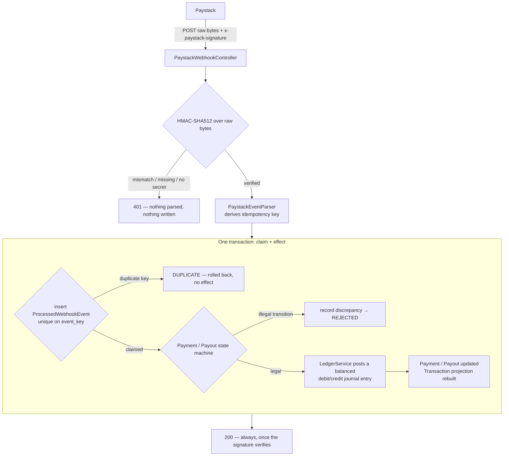
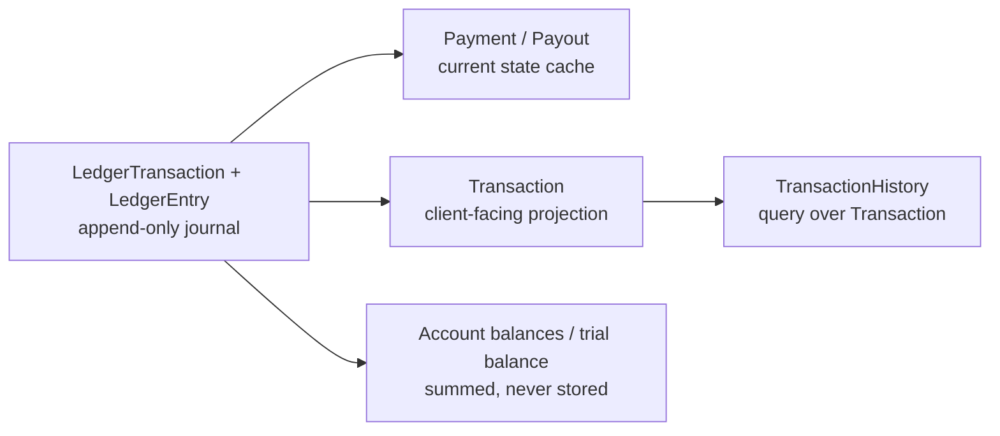

# Payments Ledger, Paystack Webhooks & Reconciliation

Implements [#41](https://github.com/workman-labs/guildworkman-core/issues/41):
turns the half-built Paystack integration into a money path that can be
trusted — signature-verified webhooks, an append-only double-entry ledger, an
explicit payment/payout state machine, and a reconciliation job that proves
the platform's books match the provider's.

The problem it closes is stated plainly in the issue: **money that can be lost
by closing a browser tab**. Before this, payment state depended on the client
returning from a redirect. It no longer does.

## How it fits together

The money path, from a Paystack delivery to a row an operator can read. The
signature check and the claim insert are the two gates — nothing downstream of
them runs twice, and nothing upstream of them is trusted.



Reconciliation runs on its own schedule and never writes to the journal — it
compares and reports:

```mermaid
flowchart LR
    S[@Scheduled sweep] --> Q[unreconciled payments<br/>older than the grace window]
    Q --> API[Paystack verify API<br/>no transaction held open]
    API --> CMP{platform books vs provider}
    CMP -->|agree| MARK[mark reconciled]
    CMP -->|diverge| D[(ReconciliationDiscrepancy<br/>deduped, OPEN)]
    TB[trial balance:<br/>total debits vs total credits] --> D
    D --> OPS[operator: acknowledge / resolve<br/>ADMIN endpoints]
```

The journal is the source of truth; everything to the right of it is derived
and can be rebuilt from it:



## What was there before

- `controllers/PaymentController.java` was entirely commented out — no payment
  endpoint, no webhook receiver.
- A second, live `PaymentController` existed in the **test** source tree
  (`src/test/java/.../payment/controller/PaymentController.java`). Because
  component scanning covers the test classpath, it was a real controller
  during `@SpringBootTest` runs and absent in production — endpoints that
  passed tests and did not exist when deployed. Both files are removed; the
  real controller is `payment/api/PaymentController.java`, in the feature-module
  layout the `booking`, `chain` and `escrow` modules already use.
- `TransactionServiceImpl` and `TransactionHistoryServiceImpl` were empty
  `@Service` stubs. They are implemented here, as projections over the ledger.
- `services/paystack/PaymentServiceImpl` is left alone. It is the pre-existing
  fire-and-forget initialize/verify helper; nothing in the new path calls it,
  and deleting it is a separate cleanup with its own blast radius.

## New dependencies

**None.** `OkHttpClient` (`AppConfig`), Jackson's auto-configured
`ObjectMapper`, and `javax.crypto`'s `Mac` cover the whole integration. No
Paystack SDK was added: the API surface used here is two REST calls and an
HMAC, and a wrapper around that would be more code than the thing it wraps.

## Schema / migrations

This codebase has no Flyway/Liquibase; schema is managed by Hibernate's
`spring.jpa.hibernate.ddl-auto=update` (see `application.properties`). New
tables are declared as JPA annotations, the same way `escrow_orchestration_requests`
and `on_chain_events` were:

| Table | Entity | Notes |
|---|---|---|
| `ledger_accounts` | `LedgerAccount` | Seeded on startup by `LedgerAccountInitializer` |
| `ledger_transactions` | `LedgerTransaction` | Unique on `reference` (the provider event key) |
| `ledger_entries` | `LedgerEntry` | Debit/credit lines |
| `payments` | `Payment` | Unique on `reference` |
| `payouts` | `Payout` | Unique on `reference` |
| `processed_webhook_events` | `ProcessedWebhookEvent` | Unique on `event_key` — the idempotency guard |
| `payment_reconciliation_discrepancies` | `ReconciliationDiscrepancy` | Unique on `dedupe_key` |

All new, so the first deploy simply creates them and every deploy after is a
no-op for them.

### One manual statement is required on any existing database

`Transaction` is now a projection of the ledger, so `TransactionStatus` gained
`PENDING`, `FAILED`, `REFUNDED` and `REVERSED` alongside the original `PAID`
and `RECEIVED` — a payment can end up failed, refunded or reversed, and a view
that could only say "paid" would misreport three of the five outcomes.

Hibernate generated a `CHECK` constraint over the original two values when it
first created the table, and **`ddl-auto=update` cannot widen an existing check
constraint**. On a database that already has a `transactions` table, every
insert of one of the new statuses fails with:

```
new row for relation "transactions" violates check constraint
"transactions_transaction_status_check"
```

Run this once per environment, before or during the deploy:

```sql
ALTER TABLE transactions DROP CONSTRAINT IF EXISTS transactions_transaction_status_check;
```

Hibernate re-adds the constraint (with the full set of values) only when it
creates the table, so a freshly-provisioned database — including the one CI
starts for each run — needs nothing. This is the "hand-written `ALTER TABLE`"
case that `application.properties` already warns about for this project's
schema strategy; it is called out here because it is easy to miss and the
failure mode is payment writes failing in production.

`transactions` also gains a nullable, uniquely-indexed `payment_reference`
column. That part *is* additive: Postgres allows any number of NULLs in a
unique index, so pre-ledger rows coexist with the constraint and no backfill
is needed.

## Architecture decisions

### 1. The ledger is the source of truth; everything else is derived

`LedgerTransaction`/`LedgerEntry` are append-only. A refund is a new posting,
not an edit to the capture; a reversed payout is a compensating entry, not a
deletion. `Payment`, `Payout` and `Transaction` are mutable *views* over that
journal — which is exactly why it is safe for them to be mutable. If a view
ever disagrees with the journal, the journal is right by definition and the
view can be rebuilt.

Append-only is enforced in two layers, and it is worth being precise about
which one actually fires. Every column on both entities is `updatable = false`
and neither class exposes a setter, so there is no in-process path to a
mutation. That mapping is the defence that engages: because no column is
updatable, Hibernate emits no UPDATE for a dirty posting at all. The
`@PreUpdate` callback is a **backstop**, not the primary guard — it exists for
the day someone adds a column and forgets the flag, and in the current mapping
it is never reached.

`LedgerAppendOnlyJpaTest` pins this at the JPA level rather than by calling
the guard directly: a posting that is reflectively rewritten and flushed
leaves the stored row untouched, and — the case that would actually hurt — a
posting merely attached to the persistence context does **not** trip anything
when unrelated entities are written and flushed in the same unit of work. An
unconditional `@PreUpdate` that misfired there would break the capture path
itself, which loads postings and saves a `Payment` in one transaction.
`LedgerPostingTest` separately asserts the guard method and that no setter has
crept back in.

Deletes are **not** blocked at the JPA layer. No application code path deletes
a ledger row, but the test suite has to reset the schema between classes, and
a JPA callback is the wrong place to enforce a guarantee that belongs to
database privileges. See "Operations" for the `REVOKE` that belongs in
production.

### 2. Balance is an invariant of the aggregate, not a rule callers follow

`LedgerTransaction.validateBalanced()` is the `@PrePersist` callback. An
unbalanced posting cannot reach the database through *any* code path,
including one written later by someone who never read the class. `LedgerService`
also calls it explicitly before saving, purely so the failure surfaces at the
posting rule that made the mistake rather than at flush time.

### 3. Money is integer minor units, everywhere except the API boundary

Amounts are `long` kobo/cents — the same representation Paystack sends and
receives — so a balanced posting stays balanced to the last unit and nothing
on the money path is ever a `double` or a scaled `BigDecimal`. Conversion to a
readable decimal happens once, at the edge, in `MinorUnits`, using the
currency's own fraction digits rather than a hardcoded 100 (NGN and USD have
two; JPY has none).

The platform's commission is configured in **basis points** for the same
reason: `platformFeeBps` × amount ÷ 10000 is integer arithmetic end to end,
where a percentage `double` is how a ledger acquires a drift nothing can
account for.

### 4. The webhook signature is checked over the raw bytes, before parsing

`PaystackWebhookController` takes `byte[]`, not a DTO. The MAC covers the
exact bytes Paystack sent, and Jackson does not promise to reproduce them —
key order, whitespace and number formatting are all free to change on a
parse/print cycle, and each of those breaks the MAC. Taking raw bytes is also
what lets verification run before the payload reaches a parser at all, which
is what the issue asks for.

Comparison uses `MessageDigest.isEqual`, not `String.equals`: the latter
short-circuits on the first differing character, which over enough attempts
leaks how much of a forged prefix was correct.

**An empty secret rejects everything.** The convenient alternative — skip
verification when no secret is configured — is an unauthenticated endpoint
that moves money, and it fails *open* in exactly the deployment most likely to
be misconfigured. Development and CI set a test secret instead. The rejection
is logged at ERROR, because in production it means every payment notification
is being dropped, which looks like "we stopped getting paid" a few hours later.

### 5. Idempotency is a database constraint, and the key is derived

Paystack's webhook envelope is `{event, data}` — there is no delivery id and
no `X-Event-Id` header — so the idempotency key has to be derived. Two rules,
in `PaystackEventParser`:

1. **`event-type:data.id`** when the payload carries a resource id. This
   covers every event type this service acts on; `data.id` is Paystack's own
   primary key for the charge, refund or transfer and is stable across
   retries. The event type is part of the key because one transfer id
   legitimately produces `transfer.success` and later `transfer.reversed`,
   and those must not collide.
2. **`event-type:sha256:<digest of the raw body>`** otherwise. A retry
   re-sends identical bytes, so identical bytes dedupe. The limitation is
   real: if Paystack ever varied a timestamp between retries of an id-less
   event, the retry would get through. That is not a silent double-credit —
   the state machine refuses the second transition and it is flagged — but it
   is why the digest is the fallback and not the primary rule.

**The claim and the effect share one transaction.** `PaystackWebhookProcessor.process`
inserts `ProcessedWebhookEvent` and applies the event in the same
`@Transactional` method. That gives both halves of the guarantee: a redelivery
after success finds the row and does nothing, and a redelivery after a
*failure* finds nothing, because the claim rolled back with the work. The
alternative — claiming in a separate committed transaction, the way
`EscrowOrchestrationInserter` does — is right when the work is a long external
RPC call, and wrong here: a crash between claim and effect would permanently
swallow a payment notification.

Two deliveries racing on two instances both insert the same `event_key`; the
unique index picks a winner and the loser's `DataIntegrityViolationException`
rolls its whole transaction back having applied nothing.
`PaystackWebhookService` catches it *outside* the transaction — it has to be
outside, since a rollback-only transaction has nothing useful left to do — and
answers `DUPLICATE`.

### 6. Illegal transitions are refused, not coerced

Paystack does not guarantee webhook ordering. For an event that doesn't fit
the current state there are two plausible policies: apply it anyway (last
writer wins) or refuse it. This refuses it. A `refund.processed` that arrives
before its `charge.success` would, if applied, post a refund against money the
books say was never collected — the entry would balance and describe something
that did not happen.

`PaymentStateMachine` is the only thing that writes a status, and it checks
*before* touching the entity, so a refused transition leaves the entity
exactly as it was. That is what lets the processor catch the exception, record
a discrepancy, and still commit the audit row.

Two consequences worth stating:

- `SUCCEEDED -> SUCCEEDED` is illegal. A redelivery never reaches the state
  machine (the event log stops it first), so a *second, distinct* success
  event for an already-captured payment is not a retry — it is the provider
  saying something unreconcilable, and it is flagged.
- `PENDING -> REVERSED` is illegal for payouts. A transfer never reported as
  paid cannot be reversed; such an event means either the `transfer.success`
  was lost or the provider is describing a payout this platform does not know
  about. Both are precisely the divergence reconciliation exists to surface.

### 7. A refused event still answers 200

Refusing with a 4xx would make Paystack retry an event that will never become
legal, and eventually disable the endpoint. The divergence belongs in the
discrepancy table where somebody will see it, not in a redelivery queue. The
response body says which case applied (`APPLIED`/`DUPLICATE`/`IGNORED`/`REJECTED`)
so the provider's delivery log shows what happened rather than an opaque `OK`.

The one thing answered non-2xx after a valid signature is a body that cannot
be parsed (400). A correctly-signed payload we cannot read means either
Paystack changed the envelope or something is badly wrong with the account, and
the delivery failing visibly in Paystack's dashboard is itself the signal.

### 8. Reconciliation reports; it does not fix

`PaymentReconciliationService` never posts to the ledger and never changes the
state of a payment whose money has been captured. An automatic fix destroys
the evidence that anything was wrong, and an accounting system whose
divergences quietly disappear is worse than one with no reconciliation at all,
because it looks correct.

The one state change it makes is deliberately not a correction. When the
provider reports a charge as `failed` or `abandoned` and the platform still has
it open, no money exists on either side; the sweep is simply learning an
outcome the webhook didn't deliver. Applying it closes out a dead intent, has
no ledger effect, and files **no** discrepancy — a client who closed the
checkout tab is not an accounting problem, and filing a finding for every one
of them would bury the findings that matter.

| Provider says | Platform says | Action |
|---|---|---|
| `success` | not captured | `PROVIDER_STATUS_DIVERGENCE` — money the books don't know about |
| `failed`/`abandoned` | captured | `PROVIDER_STATUS_DIVERGENCE` — money the books think they have |
| `failed`/`abandoned` | not captured | apply the outcome; no finding, no ledger effect |
| `success` | captured, different amount | `AMOUNT_DIVERGENCE` |
| nothing (404) | anything | `MISSING_PROVIDER_RECORD` |
| unreachable | anything | WARN and retry next sweep — an outage is not a divergence |

That last row matters: `PaystackClient.verifyTransaction` returns an empty
`Optional` for a 404 and *throws* for anything else, so one Paystack outage
cannot file a `MISSING_PROVIDER_RECORD` against every payment in the sweep.

The sweep also checks the trial balance for every currency the book holds and
files `LEDGER_IMBALANCE` if debits and credits disagree. Nothing short of a
bug in a posting rule can cause that, which is exactly why it is checked on a
schedule rather than only in tests.

### 9. Room for the on-chain leg

The issue notes that this is the fiat leg and the reconciliation model has to
leave room for the on-chain one (tracked in `com.guildworkman.api.escrow`).
`Payment`/`Payout` carry a `provider` discriminator (`PAYSTACK`, and a
reserved `STELLAR` nothing writes yet), and the chart of accounts namespaces
by provider where the distinction matters
(`PROVIDER_RECEIVABLE_PAYSTACK`). Carrying the column now costs one varchar
and means the on-chain leg can post into the same books without a schema
change to a table that will, by then, hold production money records — which,
under `ddl-auto=update`, cannot express a safe backfill of a new non-null
discriminator.

## The ledger

### Chart of accounts

| Code | Type | Holds |
|---|---|---|
| `PROVIDER_RECEIVABLE_PAYSTACK` | ASSET | Funds Paystack holds on the platform's behalf |
| `WORKER_PAYABLE` | LIABILITY | Collected funds owed to skilled workers |
| `PLATFORM_FEE_REVENUE` | REVENUE | The platform's commission |
| `PROVIDER_FEE_EXPENSE` | EXPENSE | Paystack's processing and transfer fees |

Accounts are **currency-agnostic**: a journal entry balances within a single
currency, `LedgerTransaction` carries it, and a balance is only meaningful
per-currency. Seeding one account row per (code, currency) pair would multiply
the chart by every currency Paystack settles in without making any invariant
stronger.

### Posting rules

With gross `G`, provider fee `PF`, platform commission `LF`:

```
charge capture    DR provider receivable   G - PF     CR worker payable        G - LF
                  DR provider fee expense  PF         CR platform fee revenue  LF

refund (R)        DR worker payable        R - LFr    CR provider receivable   R
                  DR platform fee revenue  LFr

payout (A, fee F) DR worker payable        A          CR provider receivable   A + F
                  DR provider fee expense  F

payout reversal   DR provider receivable   A + F      CR worker payable        A
                                                      CR provider fee expense  F
```

Each balances by construction — the debit total and the credit total are the
same expression rearranged.

**The provider's fee is expensed, not netted.** A charge could be booked as
"we received `G - PF`" in one line each side and the books would balance. They
would also stop showing what the client was charged, which is the number on
the client's receipt and the number any dispute is about.

**A declined charge posts nothing.** No money moved, and an entry for it would
have to be balanced against something that never existed. Likewise
`transfer.failed`: the payout entry is only written on `transfer.success`, so
a transfer that never left has nothing to undo.

**Refund commission is returned cumulatively.** The share for one refund is
`floor(fee × (refundedSoFar + thisRefund) / captured) − floor(fee × refundedSoFar / captured)`.
The obvious version — flooring each instalment independently — loses a unit or
two across a charge refunded in parts and leaves the worker's payable balance
slightly negative once it is fully refunded. The cumulative form telescopes:
the shares sum to exactly the commission no matter how the refund is split.
`refundingInAwkwardInstalmentsStillReturnsTheCommissionExactly` is the test
that pins it.

Note that a fully refunded charge leaves `PROVIDER_RECEIVABLE_PAYSTACK`
*negative* by the provider's fee. That is correct: Paystack keeps its fee on a
refund, so the platform really is down by it. The books balance; they just say
something uncomfortable, which is the point.

## State machines

```
Payment:  INITIATED ─┬─> PENDING ─┬─> SUCCEEDED ─┬─> PARTIALLY_REFUNDED ⟲ ─┬─> REFUNDED
                     │            ├─> FAILED     ├─> REFUNDED              └─> REVERSED
                     │            └─> ABANDONED  └─> REVERSED
                     ├─> SUCCEEDED / FAILED / ABANDONED

Payout:   PENDING ─┬─> PAID ─> REVERSED
                   └─> FAILED
```

`FAILED`, `ABANDONED`, `REFUNDED` and `REVERSED` are terminal for a payment;
`FAILED` and `REVERSED` for a payout. `PARTIALLY_REFUNDED` is the only legal
self-transition, because a charge can legitimately be refunded in instalments.

Payout rows are created lazily by the first `transfer.*` webhook that names a
reference, in `PENDING` — the state the payout was in immediately before that
event — so the event still has to pass the state machine rather than defining
the row into its own outcome. There is no payout *initiation* endpoint; see
"Follow-ups".

## Derived views

`Transaction` is refreshed from the `Payment` aggregate on every state change,
keyed by `payment_reference`, so a payment has exactly one projected row
however many times it is touched. It runs inside the webhook processor's
transaction, so the projection and the ledger posting it reflects commit
together.

`RECEIVED` is never produced by the projection: it describes funds reaching a
worker, which is the payout leg, and a payout is not tied to a single charge
(one transfer can settle many). Putting it on a charge row would be a status
the row cannot substantiate.

**Nothing writes the `TransactionHistory` entity.** A persisted history table
would be a third copy of facts the ledger already holds — one that can drift
and has to be repaired by hand when it does. `TransactionHistoryService` is a
query over the projection instead, so it cannot disagree with what it reads.
The existing entity and repository are left untouched: its mapping predates
this work, and changing its identity column would be a destructive schema
change under `ddl-auto=update`.

## Security

`/api/v1/webhooks/**` is the only unauthenticated route that can move money.
Two things make that safe, and both are deliberate:

1. **It authenticates the payload, not the caller.** Paystack posts from a
   rotating IP range holding no credential of ours; the HMAC *is* the
   authentication.
2. **It lives outside `/api/v1/payments`.** Every other payment route requires
   a bearer token. Had the public matcher lived under that prefix, a future
   edit widening it by one wildcard would silently expose them. A separate
   path means the permit-all rule cannot reach them by accident.
   `PaymentEndpointSecurityTest.thePaymentRoutesDidNotInheritTheWebhookExemption`
   asserts this directly.

The reconciliation views are ADMIN-only: a trial balance is every naira the
platform holds, and the discrepancy list is, by construction, a list of the
places money might be wrong.

Error responses follow the existing RFC 7807 contract
(`GlobalExceptionHandler`). The signature rejection is deliberately incurious —
"The webhook signature could not be verified", nothing more — so a prober
learns only that it was wrong. The specifics are logged server-side.

## API behavior

- **`POST /api/v1/payments` returns 201** with a checkout URL, and that is the
  end of the client's obligations. There is no "confirm my payment" call.
  Capture is driven entirely by the signed webhook, so a client that closes
  the tab, loses signal, or never returns from the redirect still has its
  payment completed and its entries posted.
  `aPaymentCompletesEvenWhenTheClientNeverReturnsFromTheRedirect` is the test
  for the behaviour the issue was filed about.
- **`GET /api/v1/payments/{reference}` reads state; it never causes it.**
  Polling it is a convenience for a client that did come back.
- **The payment reference is generated by the platform, not Paystack.** If the
  provider assigned it, an initialize call that timed out *after* Paystack
  created the transaction would leave a live charge with no local row and
  nothing to correlate the eventual webhook against. Generating it first means
  the row always exists before the provider knows anything, and a failed
  initialize leaves a payment reconciliation can ask about by name.
- **A failed initialize marks the payment `FAILED`.** Leaving it `INITIATED`
  would have the sweep ask Paystack forever about a transaction that was never
  created and report an entirely expected missing record.
- **A capture for an unexpected amount is booked at the amount that moved**,
  and the disagreement is reported separately. Declining to record a real
  capture because it disagreed with our expectation would put the books
  further from reality, not closer.

## Endpoints

| Method | Path | Auth | Description |
|---|---|---|---|
| `POST` | `/api/v1/webhooks/paystack` | HMAC signature | Receive a Paystack event (idempotent) |
| `POST` | `/api/v1/payments` | Bearer | Start a payment, get a checkout URL |
| `GET` | `/api/v1/payments/{reference}` | Bearer | Read a payment's current state |
| `GET` | `/api/v1/payments/{reference}/ledger` | Bearer | The journal entries that payment produced |
| `GET` | `/api/v1/payments/reconciliation/discrepancies` | Bearer + ADMIN | List findings (default `OPEN`) |
| `GET` | `/api/v1/payments/reconciliation/discrepancies/by-reference/{reference}` | Bearer + ADMIN | Findings for one reference |
| `POST` | `/api/v1/payments/reconciliation/discrepancies/{id}` | Bearer + ADMIN | Acknowledge or resolve a finding |
| `GET` | `/api/v1/payments/reconciliation/trial-balance` | Bearer + ADMIN | Debits vs credits, and each account's balance |
| `POST` | `/api/v1/payments/reconciliation/run` | Bearer + ADMIN | Run a sweep now |

All are annotated for OpenAPI and appear at `/swagger-ui.html`.

## Configuration

| Property | Default | Purpose |
|---|---|---|
| `payments.paystack.base-url` | `https://api.paystack.co` | Paystack API root |
| `payments.paystack.secret-key` | `${PAYSTACK_SECRET_KEY:}` | Signs outbound calls, verifies inbound webhooks. **Empty rejects every webhook.** |
| `payments.paystack.request-timeout` | `PT10S` | Per-call HTTP timeout (call/connect/read/write) |
| `payments.platform-fee-bps` | `250` | Platform commission in basis points (2.5%) |
| `payments.default-currency` | `NGN` | Used when a request names no currency |
| `payments.reconciliation-grace` | `PT15M` | How long a payment is left alone before the sweep asks about it |
| `payments.reconciliation-batch-size` | `50` | Payments examined per sweep |
| `payments.reconciliation.poll-delay-ms` | `60000` | Sweep interval |

`payments.reconciliation.poll-delay-ms` sits outside `PaymentProperties` on
purpose, the same way `booking.expiry-sweep-delay-ms` does: `@Scheduled` reads
it as a raw placeholder, not through a bound properties object. `pom.xml`'s
surefire block defaults it to an hour so no `@SpringBootTest` leaves a sweep
running against the shared test database.

## Operations

### Withhold DELETE on the journal

The application never deletes a ledger row. Make that structural rather than
conventional:

```sql
REVOKE DELETE, UPDATE ON ledger_transactions, ledger_entries FROM <application_role>;
```

Nothing in the app needs either grant on those two tables. (Do not revoke them
on the test database — the suite resets state between classes.)

### A payment Paystack says succeeded but the books never captured

This is `PROVIDER_STATUS_DIVERGENCE` and it means real money is unaccounted
for. **Do not hand-write ledger entries.** Replay the `charge.success` event
from Paystack's dashboard: the webhook path will post it, with the provider's
own amounts and fees, and the idempotency guard makes replaying it twice
harmless. Then resolve the finding with a note saying what was replayed.

### A discrepancy that turns out to be fine

`POST /api/v1/payments/reconciliation/discrepancies/{id}` with
`{"status":"RESOLVED","resolutionNote":"..."}`. This records that a human
dealt with it and changes nothing else — not the ledger, not the payment, not
the observed values. If money has to move, that is a new journal entry.

### `LEDGER_IMBALANCE`

A posting rule is wrong and every figure derived from the ledger is suspect.
`GET /api/v1/payments/reconciliation/trial-balance?currency=NGN` shows the
difference; `ledger_transactions` grouped by `type` narrows down which rule.
Stop deploying and fix the rule — the imbalance will not resolve itself, and a
compensating entry written before the cause is understood just moves the
problem.

### Tuning `payments.reconciliation-grace`

Too low and the sweep asks Paystack about payments the client is still paying,
reporting missing records that appear seconds later. Too high and real drift
sits undetected. 15 minutes comfortably exceeds a checkout session; it does
not need to exceed webhook delivery latency, because a payment whose webhook
simply hasn't arrived yet will show up as a `PROVIDER_STATUS_DIVERGENCE` that
the next successful delivery makes moot — and the finding's dedupe key stops
it being re-filed.

### Rotating the Paystack secret key

The secret both verifies inbound webhook signatures and authenticates outbound
API calls, and Paystack signs with whichever key is live at the moment it
sends. There is no dual-key window on the provider side, so a rotation is a
brief period where in-flight deliveries are signed with the old key.

The sequence that loses nothing:

1. Rotate the key in the Paystack dashboard.
2. Update `PAYSTACK_SECRET_KEY` in the secret store and restart/redeploy so
   `payments.paystack.secret-key` picks it up. It is read from the environment
   only — it is never in `application.properties`, in the image, or in git.
3. Watch `payments.webhook.signature.failures{reason="MISMATCH"}`. A short
   spike during the swap is expected: those are deliveries signed with the old
   key that arrived after the restart.
4. Paystack retries a non-2xx delivery, and a rejected webhook answers 401, so
   those events come back on their own once the new key is live. Nothing needs
   replaying by hand.
5. Confirm `payments.webhook.events{outcome="APPLIED"}` resumes. If
   `signature.failures{reason="MISMATCH"}` stays elevated after the retry
   window, the deployed key and the dashboard key do not match — check step 2
   before assuming an attack.

**`reason="NOT_CONFIGURED"` is the dangerous one.** It means the variable is
absent entirely and *every* webhook is being dropped. It fails closed by
design, but the symptom — payments silently not capturing — is indistinguishable
from a quiet day, which is why it has its own counter and deserves a page.

If a key is believed compromised, rotate first and reconcile after: a sweep
(`POST /api/v1/payments/reconciliation/run`) re-reads provider state for every
unreconciled payment and files a finding for anything that diverged while the
old key was valid.

## Observability

### Metrics

`PaymentMetrics` publishes Micrometer counters at `/actuator/prometheus`,
following the `SigningMetrics` convention already in this codebase.

| Meter | Tags | Alert on |
|---|---|---|
| `payments.webhook.events` | `type`, `outcome` | A sustained `REJECTED` rate; `APPLIED` dropping to zero during business hours |
| `payments.webhook.signature.failures` | `reason` | **Any** `NOT_CONFIGURED` — the secret is missing and every payment notification is being dropped. A rising `MISMATCH` is someone probing the endpoint |
| `payments.reconciliation.discrepancies` | `type` | Any `LEDGER_IMBALANCE` (page immediately); a rising `PROVIDER_STATUS_DIVERGENCE` |
| `payments.reconciliation.sweeps` | `outcome` | `outcome=failed`, and `completed` going flat — a stalled sweep looks exactly like "no divergence found" |
| `payments.provider.unreachable` | — | A sustained rate means Paystack is unreachable, not that nothing is happening |

Tag values are closed sets. The event `type` is the one piece of
caller-supplied data it would be tempting to tag with directly, and doing so
would let anyone who can reach the webhook mint unbounded time series by
POSTing new type strings; `PaymentMetrics.eventType` collapses anything
outside the handled set to `other`. No reference, event key or account is ever
a tag — those live in logs.

The counters exist because the failures that matter here are the silent ones.
A rotated secret that was never redeployed throws nowhere an operator is
looking; it just rejects every webhook, and the first visible symptom is that
captures stopped some hours ago.

### Logs

Every state transition, ledger posting, event outcome and discrepancy is
logged with the reference, so a log search on a payment reference reconstructs
its whole history. Discrepancies are logged at WARN with the **discrepancy
id** and both states in the message, and a refused event logs the same id, so
triage goes straight from the log line to
`/api/v1/payments/reconciliation/discrepancies` without joining tables by
timestamp. Paystack response bodies are truncated to 500 characters before
being logged or embedded in an exception message.

**Secrets are never logged.** The only log line that mentions the secret names
the *property* (`payments.paystack.secret-key`), never a value; the
invalid-signature line records the body length, not the supplied signature.
`PaystackProperties` carries no Lombok `@ToString`, so the key cannot reach a
log through an accidental interpolation of the properties object.

## Tests

| Class | Covers |
|---|---|
| `PaystackSignatureVerifierTest` | Valid, forged, missing, blank, truncated, and a real signature over tampered bytes; fail-closed on an unconfigured secret |
| `PaystackEventParserTest` | Idempotency-key derivation, including one transfer id under two event types; malformed envelopes |
| `PaystackClientTest` | The wire format against a `MockWebServer`; 404 vs. outage; path encoding; body truncation |
| `PaymentLifecycleTest` | Every legal and illegal transition on both state machines |
| `LedgerAppendOnlyJpaTest` | Append-only as JPA applies it: a rewritten posting leaves the row untouched, and a posting merely attached to the persistence context does not break unrelated writes in the same transaction |
| `LedgerPostingTest` | Balance enforcement, negative and zero lines, append-only guards, absence of setters |
| `MinorUnitsTest` | Two-decimal, zero-decimal and unknown currencies; refusal to round |
| `PaymentWebhookIntegrationTest` | The money path end to end: capture, redelivery, 8-way concurrent redelivery, forged signature, out-of-order refund and reversal, partial and instalment refunds, payout settlement and reversal, and the trial balance after every scenario |
| `PaymentReconciliationIntegrationTest` | Each row of the reconciliation table above, the grace window, dedupe, ledger-imbalance detection, and the operator workflow |
| `PaymentEndpointSecurityTest` | The webhook reachable without a token, the payment routes not, ADMIN on the reconciliation views, and the RFC 7807 shape of each failure |

## Follow-ups (out of scope for this PR)

- **Initiating payouts.** Calling Paystack's Transfer API needs transfer-recipient
  management (creating and storing recipient codes per worker), which is its
  own piece of work. Until then payout rows are created by `transfer.*`
  webhooks for transfers initiated out-of-band, and a transfer whose metadata
  names no known worker is booked and flagged rather than dropped.
- **Settlement.** `PROVIDER_RECEIVABLE_PAYSTACK` is not the platform's bank
  balance; it becomes that on settlement, which needs a `PLATFORM_CASH`
  account and Paystack's settlement webhooks.
- **Initialization idempotency.** A retried `POST /api/v1/payments` creates a
  second payment. It is harmless — no ledger effect until a charge succeeds,
  and the abandoned one is closed out by reconciliation — but an
  `Idempotency-Key` header would be tidier, matching the pattern
  `SubmitOrchestrationRequest` already uses.
- **Consolidating the two legs.** The on-chain leg has its own reconciliation
  (`EscrowReconciliationService`) against the ingested event stream. Posting
  both legs into one set of books is the natural next step; the `provider`
  discriminator and the account naming are there for it.
- **Retiring `services/paystack/PaymentServiceImpl`** once nothing references
  the old initialize/verify helper.
- **Micrometer metrics**, if the team introduces Actuator app-wide.
